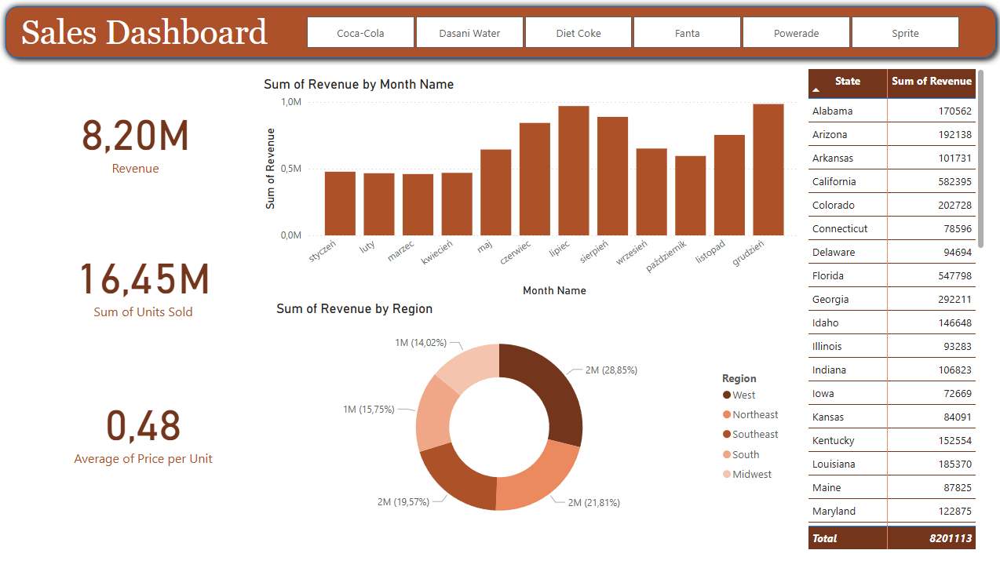

# Power-Bi-Sales-Dashboard
I created an interactive Sales Dashboard to visualize and analyze comapny performance accros the United States.
To open and explore this Power BI dashboard, please install Power BI Desktop.

It include:
- Company revenue
- Monthly income
- Total income
- Sum of revenue by region                                            
- Sum of units sold
- Average of price per unit

Companies coverd:
- Coca-Cola
- Dasini Water
- Diet Coke
- Fanta
- Powerade
- Sprite

Tool used:
- Microsoft Power BI

The data used in this dashboard is based on the tutorial:
https://www.youtube.com/watch?v=nkmHqs1I_z0

Dashboard Preview:

